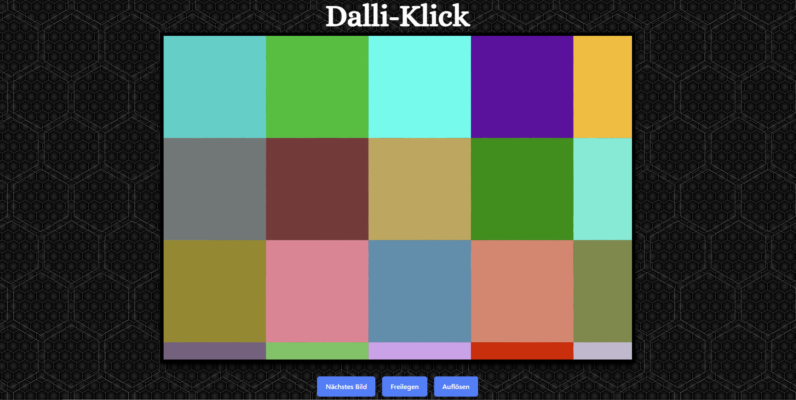
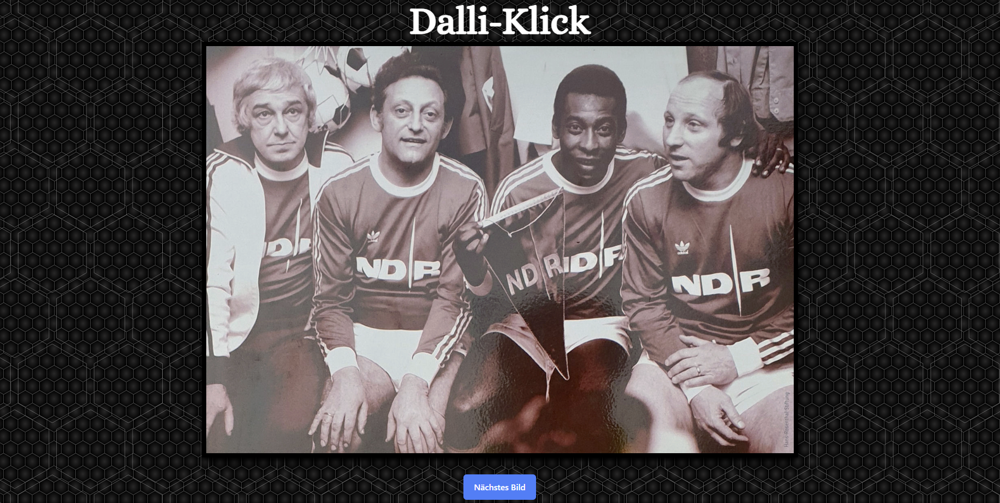

# Dalli-Klick-TW
## (Dalli-Klick-Tailwind)
Ein schnell zusammen-gehacktes Dalli-Klick Spiel des legendären Quizmasters Hans Rosenthal, das im Browser spielbar ist.   
Allerdings __ohne__ Punktesystem.
Optimiert mit Tailwind CSS. Läuft in jedem Browser.

### Abhängigkeiten
- python3
- pip
- Web-Browser
- (Zum selbst "Bauen" wird Node.js und Tailwind benötigt)

### Installation
```
git clone https://github.com/arboeh/Dalli-Klick-TW
cd Dalli-Klick-TW
pip install -r requirements.txt
```

### Ausführen
Um das Dalli-Klick Spiel zu starten benötigt man ein Verzeichnis,
das die Bilder enthält, die erraten werden sollen.   
Zum Starten folgendes ausführen:
```
./main.py <VERZEICHNIS MIT BILDERN>
```
Danach ist das Spiel unter [http://127.0.0.1:5000](http://127.0.0.1:5000)
zu erreichen.

### Benutzen




Das Bild, das erraten werden muss befindet sich oben in dem schwarzen Kasten und ist mit bunten Quadraten überdeckt.
Darunter befinden sich drei Buttons.
Um nach und nach mehr vom Bild zu zeigen auf `Freilegen` drücken. Dies entfernt automatisch alle drei Sekunden ein farbiges Quadrat über dem Bild.
Der Vorgang kann mit `Pause` unterbrochen werden. Während des "Freilegens" ertönt eine Hintergrundmelodie im Browser.
Um alle Quadrate auf einmal zu entfernen auf `Auflösen` drücken.    
Zum nächsten Bild kann man über den Button `Nächstes Bild` gelangen.

### Medien
Die hier abgebildeten, bzw. verwendeten Medien unterliegen der Creative Commons Lizenz (CC).
- Screenshot "Hans-Rosenthal-Elf"
  - Link: https://commons.wikimedia.org/wiki/File:Gedenktafel_Waldschulallee_34_%28Westend%29_Hans_Rosenthal%E2%80%93Elf.jpg
  - User: OTFW (https://commons.wikimedia.org/wiki/User:OTFW)
  - Originaldatei: https://upload.wikimedia.org/wikipedia/commons/4/49/Gedenktafel_Waldschulallee_34_%28Westend%29_Hans_Rosenthal%E2%80%93Elf.jpg

- Hintergrundbild "Dual Hexagon Pattern"
  - Link: https://www.deviantart.com/mystica-264/art/Dual-Hexagon-Pattern-10k-893229142
  - User: mystica-264 (https://www.deviantart.com/mystica-264)

- Hintergrundmelodie "Quiz Game Music Loop"
  - Link: https://freesound.org/people/portwain/sounds/220060/
  - User: portwain (https://freesound.org/people/portwain/)